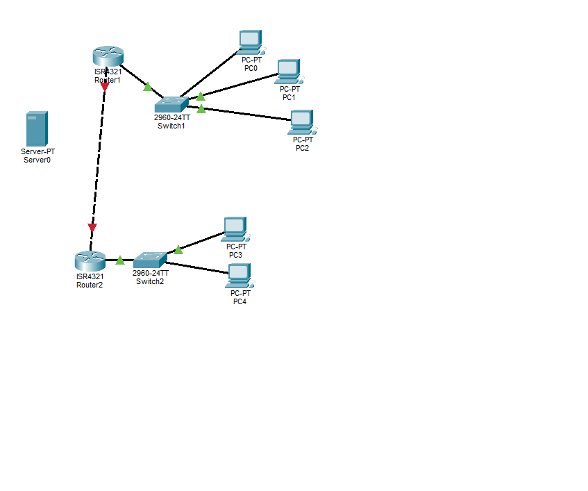
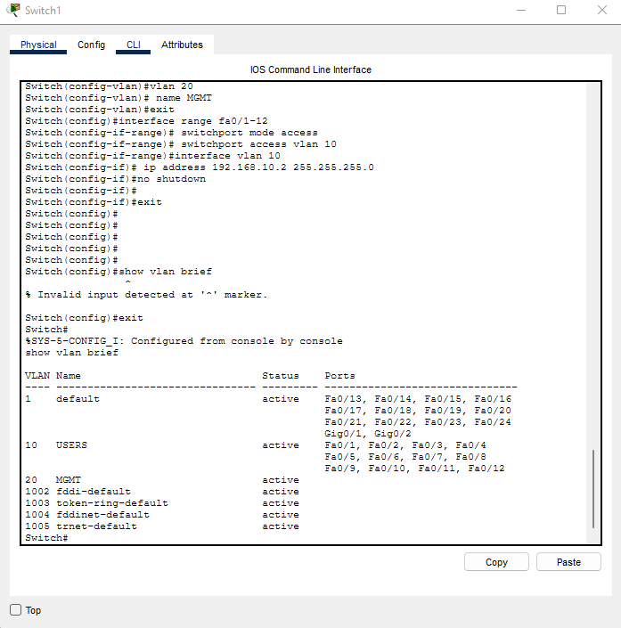
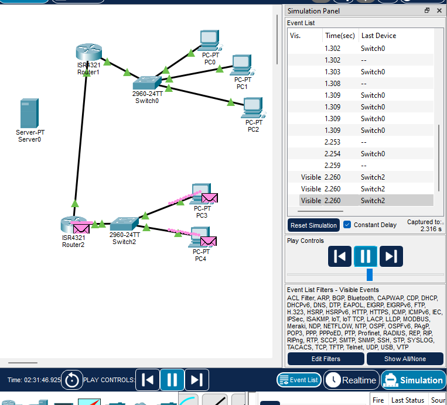
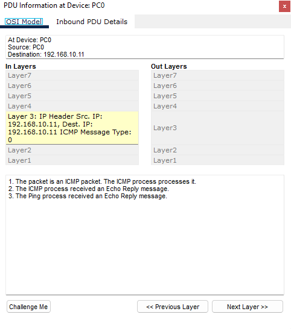
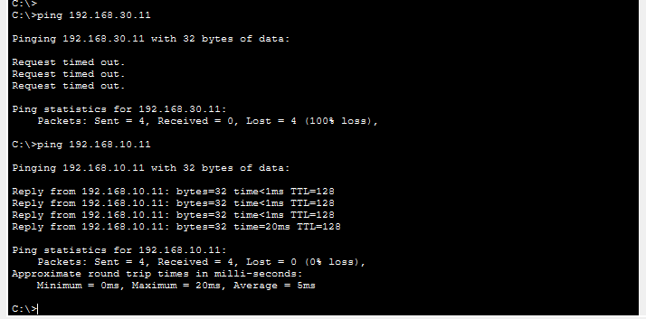
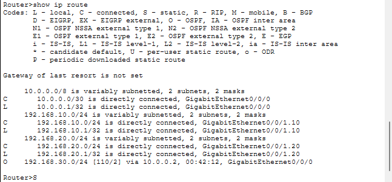

# Network-Foundation-Homelab

## Overview
A 2-site enterprise network built in Cisco Packet Tracer demonstrating VLAN 
segmentation, inter-VLAN routing, and OSPF between two branch routers.

## Objectives
- Segment traffic using VLANs
- Configure router-on-a-stick for inter-VLAN routing
- Establish dynamic routing with OSPF
- Verify connectivity and troubleshoot using simulation mode

## Topology

## IP Addressing Plan
| Segment | Network | VLAN |
|---|---|---|
| Site A LAN | 192.168.10.0/24 | VLAN 10 |
| Site A Voice/Mgmt | 192.168.20.0/24 | VLAN 20 |
| Site B LAN | 192.168.30.0/24 | VLAN 10 |
| WAN link R1-R2 | 10.0.0.0/30 | — |

## Configuration

## Verification

## What I Learned
Building this lab reinforced networking fundamentals, but the real learning came 
from troubleshooting a fully broken network back to working — a much closer 
simulation of real NOC/network engineering work than a clean build would have been.

Key issues I diagnosed and resolved:
- **Subinterface dependency on the physical interface**: a subinterface (e.g. 
  Gig0/0/1.10) stays down if its parent physical interface is administratively 
  down, even if the subinterface itself has `no shutdown` applied.
- **Trunk vs. access port mismatches**: inter-VLAN routing via router-on-a-stick 
  requires the switch port facing the router to be a trunk carrying the correct 
  VLANs — an access port silently blocks the traffic with no obvious error.
- **VLAN encapsulation tagging**: a router subinterface configured with the wrong 
  `encapsulation dot1Q` VLAN number will drop traffic even when IP addressing, 
  routing, and switch config all look correct — this was the root cause of a 
  connectivity issue that took extensive isolation testing to trace, since every 
  other layer checked out fine.
- **Spanning Tree convergence delay**: newly trunked ports take 30-45 seconds to 
  move from listening/learning to forwarding state, which can look like a 
  persistent failure if tested too early.
- **Systematic Layer 1-3 troubleshooting**: working top-down through physical 
  links, VLAN/switching config, IP addressing, and OSPF routing/ARP tables to 
  isolate a failure to its exact layer, rather than guessing at fixes.

This lab gave me hands-on experience with the kind of multi-layer troubleshooting 
NOC and network engineering roles handle daily, and confirmed I can systematically 
work through a connectivity issue rather than randomly changing configs.
